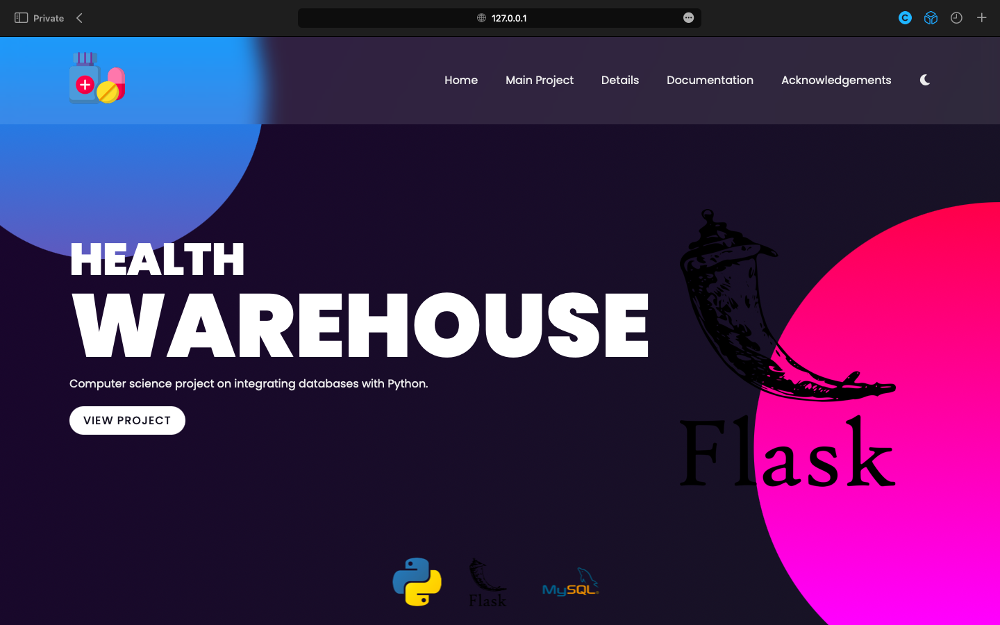

# Health Warehouse
## Computer Science Project — Class XII
### Kshitij Srivastava (XII – A)

## Introduction

The aim of this project is to create a fully operational system for a medicine store to keep track of its day-to-day
functioning — from keeping track of current inventory of medicine stock, to recommendations to restock certain
medicines, to (possibly) generating beautiful invoices for the customer upon purchase — all done online.

## Goals

There are a few goals and key features which will most certainly make their way into the project to help get the basic
backbone in place. They are listed as follows:

- Create a modern, lightweight and powerful inventory management solution to help keep track of all the current stock in
  the store along with the data about medicine quantity, potency and expiry date to allow the employees access to vital
  data quickly and easily.
- Create dynamic and beautiful cards which provide important snippets of information based on the current medicine
  stock, data and other vital information.

The ethos of the project revolves around not only creating the best user experience possible but also creating the best
developer and development experience possible as well because, while most projects focus on the former, the latter is
left relatively untouched leading to bad coding practices, messy code, using legacy software and making code difficult
to read and change later down the line. This is however, not what this project will allow. The core functionality will
not compromise the development experience of this program.

## Potential Features

There are also a few features that I would love to integrate into the project however, they may not make it in the final
build either due to time or complexity reasons but, if implemented, will be as polished and well-thought-out as possible
– not making the user feel like they were added for the sake of adding new features; these are listed as follows:

- Add a fully customisable customer invoice that can be modified on-the-fly without hassle, rather than a base template.
- Add simple bookkeeping to the program so that small stores don't need to work with the error-prone pen and paper
  method to store their day-to-day earnings and losses.
- Add user accounts to the program to that multiple employees can be given their own account with account-specific
  features and, add admin level access to monitor all accounts and features globally.

## Technologies

### Python

I shall be using Python 3.10 in a virtual environment for easy deployment without having to first install all Python
packages on another system. I will also split the code into multiple files to make the code more readable and easy to
work with along with some basic object-oriented programming concepts to make the development of the program as easy and
as fun as possible.

The following libraries will bse used with Python:

- ### Flask
    - Flask is a lightweight and powerful Python framework to create basic websites using Python and HTML. This should
      make the project easy to maintain and allow changes to the code quickly and easily. It also makes it very easy to
      host this project on a custom domain at a future date. The version of Flask being used for the project is 2.0.3.

- ### MySQL Connector
    - MySQL connector is a Python library that allows for easy connection to a local MySQL database used for storing all
      the important information regarding the project.

- ### Sphinx
    - Sphinx is a Python library that helps to easily create an HTML file for project documentation using the
      Restructured Text markup language in docstrings for the Python code. It has also been used to document the
      JavaScript code snippets as well.

### MySQL

The MySQL flavour of SQL developed by Oracle is going to be the main database of choice for the program and act as the
backend to store all the vital project information like medicine details, employee details and sale information.

### IDE

The IDE of choice for this project is Pycharm Professional as it has all the benefits of the Pycharm Community Edition
IDE but with added support for Flask and easy linking of external databases.

### Version Control

The project is open source and will be hosted on GitHub to ensure that the teacher can check up on the progress made on
the development of the program at any time and allow for the publishing and submission of the same online.

## Tasks Completed

After the completion of this project within a reasonable deadline, I was able to complete the following tasks:

✅ Inventory Management\
✅ Connection to Local MySQL Database\
✅ Frontend using Flask\
✅ Complete Documentation using Sphinx\
❌ Customer Invoice\
❌ Book Keeping\
✅ User Accounts
